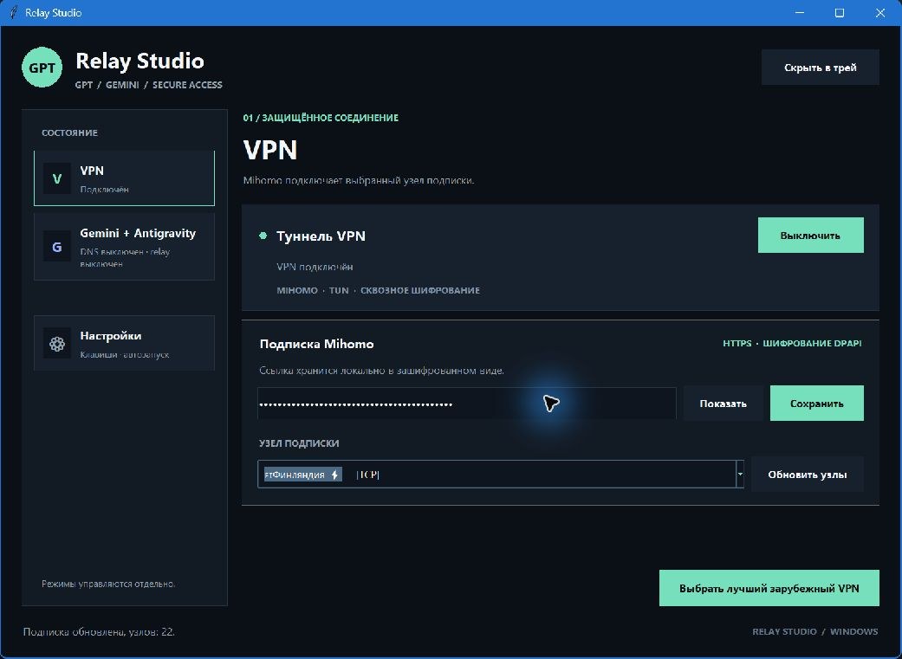
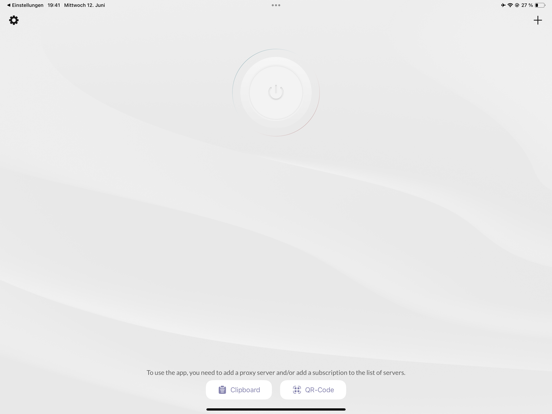
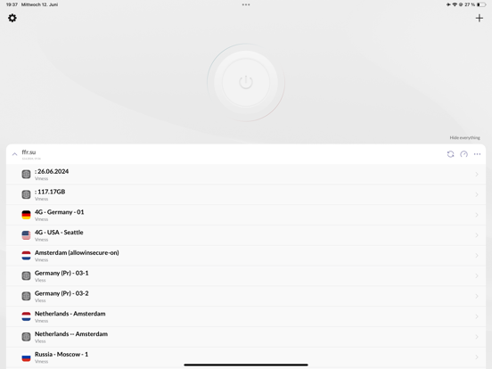

# Relay Studio: план перехода на PyQt6

Дата исследования: 1 октября 2026 года. Исходный код: `c4c61b0`, версия проекта `2.3.1`.
Это план реализации. PyQt6 ещё не установлен, приложение не переписано.

## 1. Цель и границы

Сделать компактный Windows-клиент, в котором сразу понятны состояние соединения, выбранный сервер и следующее действие. Качество HAPP использовать как ориентир для иерархии, списка серверов и аккуратности деталей. Перенести оболочку на **PyQt6 / Qt Widgets**, сохранив Mihomo, Gemini DNS, relay и существующие пользовательские настройки.

**Текущая сессия пользователя и Codex работает через Relay Studio. Её нельзя прерывать.** Во время разработки нельзя запускать второй управляющий экземпляр, завершать текущий процесс, менять узел, VPN, DNS, маршруты или автозапуск. Живое переключение возможно только в отдельно согласованное пользователем окно обслуживания. В этой работе таких действий не выполнялось.

## 2. Что действительно увидели

### Работающий Relay Studio



Это реальный снимок уже запущенного Windows-окна. Подписка была скрыта самим интерфейсом. На снимке видны тёмная тема, крупный GPT-бейдж, две основные страницы и активный VPN. Точный build работающего процесса не установлен.

**Окно не соответствует текущему checkout:** в `src/dashboard.py` уже светлая тема, четыре страницы (`vpn`, `google`, `ag`, `settings`), правая панель состояния и начальный размер 1180 × 740 логических единиц до собственного масштабирования. Перезапуск ради свежего снимка не делался. Поэтому далее отдельно отмечены наблюдения по экрану и по исходному коду.

Попытка перейти на другую страницу не изменила изображение; инструмент сообщил о более высоком уровне прав окна. Другие страницы действующего процесса не обследованы. Это ограничение автоматизации, а не доказательство зависания приложения.

### HAPP: официальный визуальный образец





Источник — [страница HAPP от Flyfrog LLC в App Store](https://apps.apple.com/us/app/happ-proxy-utility/id6504287215), изображения получены через каталог Apple. **Это опубликованные скриншоты iPad, не снимки установленного HAPP для Windows.** Они показывают визуальные приёмы, но не доказывают расположение и поведение элементов Windows-клиента.

HAPP не имел открытого окна при проверке. Запускать его с неизвестным автоподключением поверх действующего VPN было бы нарушением ограничения пользователя. Прямое сравнение двух Windows-клиентов остаётся незавершённым: позже нужно снять главный экран, список серверов и настройки HAPP, когда пользователь сам безопасно откроет его без подключения. Источники изображений записаны в [sources.json](docs/ui-review/2026-10-01/sources.json).

### Сравнение и решения

| Аспект | Наблюдение HAPP на официальных изображениях | Relay Studio | Решение для Qt |
|---|---|---|---|
| Главное действие | На пустом экране выделена большая кнопка питания | На живом снимке конкурируют подключение, сохранение и выбор лучшего узла | Один главный переключатель VPN; операции подписки вторичны |
| Серверы | Строки с названием, флагом, дополнительной подписью; группа подписки | В снимке и текущем коде — выпадающий список | Постоянно видимый список с поиском, выбранным и подключённым узлом |
| Иерархия | Компактные подписи, повторяемые строки | На живом снимке много капса, рамок и технических лозунгов | Три уровня текста, единый ритм отступов, цвет только для действия и состояния |
| Настройка подписки | Пустой экран предлагает импорт; заполненный показывает содержимое | Поле URL занимает заметную часть основной страницы | После импорта показывать название и число серверов; URL — в редактировании |
| Свободное пространство | Пустой экран оставляет место главному действию | На снимке есть большой пустой промежуток перед нижней кнопкой | Пространство распределять по задачам; серверы получают доступную высоту |
| Масштабирование | По статичным изображениям поведение не установлено | В коде есть ручной `ui_scale`, фиксированные ширины и три колонки | Qt layouts, логические единицы, прокрутка, адаптация к ширине |
| Состояния ошибок | Эти изображения ошибок не показывают | Есть модели состояний, но результат выводится в разные подписи | Единая модель состояния, причина ошибки рядом с действием |

Не копировать низкую контрастность кнопки на пустом HAPP-экране и мобильную компоновку целиком. «Дорого» здесь означает согласованность размеров, качественный текст, ясные состояния и предсказуемые действия.

## 3. Целевой экран

Две основные группы: **VPN** и **Google**. В Google — отдельные страницы **Gemini Web** и **Antigravity**. Настройки доступны отдельно. Это сохраняет два направления продукта и три независимых переключателя.

```text
┌ Relay Studio ────────────────────────────────────────────────┐
│ VPN             │ VPN                                       │
│ Подключено      │ ● Подключено                 [Отключить]   │
│                 │ Финляндия · проверено 12:40                │
│ Google          │                                           │
│  Gemini Web     │ Подписка · 22 сервера   [Обновить] [···]    │
│  Antigravity    │ [Поиск сервера________________________]    │
│                 │ Финляндия       VLESS     42 мс   Активен  │
│                 │ Германия        VLESS     58 мс            │
│ Настройки       │ Нидерланды      VLESS      —               │
│                 │                                           │
│                 │            [Выбрать лучший вне России]    │
├ Готово / ход текущей операции ───────────────────────────────┤
└─────────────────────────────────────────────────────────────┘
```

Числа в схеме — демонстрационные. Реальный интерфейс не должен подставлять их при отсутствии измерений.

### Визуальная спецификация

- Базовая светлая тема: фон `#F5F6F8`, поверхность `#FFFFFF`, текст `#1F2933`, вторичный текст `#5F6B76`, граница `#DDE2E7`, акцент `#315F85`. Цвета вынести в токены, проверить контраст на итоговом рендере.
- Шрифт Segoe UI с системным fallback. Основной текст 10–11 pt, вторичный 9–10 pt, заголовок страницы 18–20 pt. Не делать весь интерфейс полужирным.
- Сетка отступов 4/8/12/16/24. Высота кнопок 34–38 DIP, строк серверов 48–56 DIP. Скругления 6–8 DIP; тонкие границы, без неоновых теней.
- Базовое окно примерно 940 × 660 DIP. На узком окне подробности состояния переходят под основной блок, а не сжимают форму третьей колонкой. Настройки прокручиваются.
- SVG-иконки одного набора и одинаковой толщины. Убрать круглый GPT-бейдж из роли логотипа всего продукта; сервисные знаки использовать только рядом с соответствующим сервисом.
- Свойства hover/focus/disabled/pressed задаются для каждого интерактивного элемента. Состояние обозначается текстом и символом, а не только цветом.
- Сохранить системную рамку Windows на первом этапе: перемещение, масштабирование, Snap и системное меню важнее собственной строки заголовка.
- Изменение темы не должно менять соединение. Тёмную тему добавлять после приёмки светлой; сначала добиться качества одной темы.

## 4. Техническое решение

**Qt Widgets**, без QML и встроенного браузера для первого перехода. `QMainWindow`, layouts и `QStackedWidget` достаточно для этих экранов. Для серверов — `QListView` + `QAbstractListModel` + делегат; сортировка и фильтр через `QSortFilterProxyModel`. Такой список позволяет сохранять выделение при обновлениях и отделять данные от отрисовки. Основание: [Qt Model/View](https://doc.qt.io/qt-6/model-view-programming.html).

Не переносить `root.after()` и обновления Tk-виджетов буквально. Фоновые операции выполняются worker-объектами, результаты поступают в GUI через сигналы; виджеты обновляются только в основном потоке. Для длительной операции — `QObject` worker в `QThread`, с тайм-аутом и кооперативной отменой. Не вызывать `QThread.terminate()` для отмены сетевого действия. См. [QThread](https://doc.qt.io/qt-6/qthread.html).

### Что сохранить и что заменить

| Сейчас | Действие |
|---|---|
| `src/mihomo_backend.py`, `src/gemini_dns.py`, `src/ag_unlocker.py` | Сохранить поведение, подключать через контроллер после отдельной проверки |
| `src/ui_model.py` | Переиспользовать чистые представления VPN/Gemini; расширить снимком состояния |
| `src/components/base.py`, `src/components/view_model.py` | Сохранить контракты установки и представления компонентов |
| `src/dashboard.py` | Поэтапно заменить Qt-страницами, не копировать класс целиком |
| `src/start.py` | Отделить маршрутизацию helper-команд от выбора UI; `QApplication` создавать только для Qt-оболочки |
| `start.py` | Убрать прекращение предыдущего экземпляра из обычного открытия; подготовить безопасный запуск раньше переключения UI |
| `src/tray.py` | Извлечь команды из приватных обработчиков; Qt-трей вызывает тот же контроллер, что и окно |
| `src/hotkey.py` | На первом этапе сохранить Win32-регистрацию, направить callback в Qt-сигнал |
| `src/health.py` | Один источник наблюдений и одна периодическая задача; GUI читает снимок |
| `src/app_config.py`, DPAPI-хранилище, `hotkeys.json` | Сохранить совместимость и пользовательские данные; не переименовывать папку данных одновременно с UI |

Предлагаемые новые файлы, которых ещё нет:

```text
src/ui_qt/app.py                 QApplication и запуск оболочки
src/ui_qt/main_window.py         окно и навигация
src/ui_qt/theme.py               размеры, цвета, QSS
src/ui_qt/pages/                 vpn, gemini, antigravity, settings
src/ui_qt/models/server_list.py  модель списка серверов
src/ui_qt/controller.py          команды и сигналы для UI
src/ui_qt/tray.py                Qt-трей
src/ui_qt/preview.py             только вымышленные данные
```

Не заводить несколько независимых копий состояния. Снимок контроллера должен содержать режим, фактическое и желаемое состояние, выбранный и активный узел, текущую операцию, время наблюдения и безопасный код ошибки. Номер операции позволяет отбрасывать результат старого запроса.

## 5. Пошаговая реализация

### Шаг 0 — безопасный вход и граница с текущей сессией

1. Зафиксировать базовый commit и список незакоммиченных файлов; сохранить существующие изменения.
2. Подготовить отдельную точку входа предпросмотра. Предлагаемая команда `py -3 -m src.ui_qt.preview` **пока не существует**.
3. Предпросмотр не импортирует запускающие backend-классы, не читает настоящую подписку, не регистрирует глобальные клавиши, не создаёт production mutex, не меняет автозапуск и не отправляет команды контроллеру.
4. Исправление обычного launcher подготовить отдельно: повторный запуск должен просить действующий экземпляр показать окно. `_stop_old_suite()` не должен выполняться при открытии UI.

**Результат:** можно сколько угодно запускать и закрывать прототип; действующая сессия не участвует. Приёмка — проверка границы адаптеров и демонстрационные сценарии, без живого TUN.

### Шаг 1 — зависимости и каркас

1. Добавить PyQt6 отдельной UI-зависимостью и зафиксировать проверенные версии Python/PyQt6/Qt в окружении. Не ставить зависимости в работающий runtime.
2. Создать каркас окна, навигацию и токены. Пока только синтетические данные.
3. Qt отвечает за DPI; не переносить ручное умножение `ui_scale` и Tk-настройки DPI. Проверить результат на 100/125/150/200%. См. [Qt High DPI](https://doc.qt.io/qt-6/highdpi.html).
4. Зафиксировать условия распространения: PyQt доступен по GPLv3 либо коммерческой лицензии Riverbank. Нынешняя запись `MIT` в проекте сама по себе этот вопрос не решает. До релиза выбрать совместимую схему и состав notices. Используем именно запрошенный PyQt6; смена binding не входит в этот план. [Условия Riverbank](https://www.riverbankcomputing.com/software/pyqt/).

**Результат:** окно с четырьмя страницами внутри двух продуктовых групп, корректным Tab-порядком и общим стилем.

### Шаг 2 — закончить VPN-страницу в preview

1. Верхний блок: состояние, активный узел, одна кнопка подключения.
2. Постоянный список серверов: страна, имя, протокол, задержка, активность. Фильтр «вне России» допускает отдельную категорию «страна неизвестна».
3. Разделить выбранный курсором узел и реально активный. Навигация по списку не переключает работающий туннель. Явная команда подключения/смены применяет выбор.
4. Импорт подписки — компактный диалог с видимым результатом, сохранением введённого значения при ошибке и кнопкой показа/скрытия URL. После успеха главное место занимает список.
5. Кнопка выбора лучшего показывает ход поиска, измерения и отмену. Не называть измерение задержки проверкой страны выхода. Во время защищённой текущей сессии применение другого узла недоступно.
6. Отрисовать пустую подписку, 1/22/200 серверов, длинные названия, отсутствие сети, ошибку импорта и неподтверждённое соединение.

**Результат:** комплект скриншотов этих состояний. Ни один UI-флаг не выдаёт фиктивное «Подключено» в production.

### Шаг 3 — Gemini, Antigravity и настройки

1. Gemini: отдельно показывать DNS, ответ сайта, наблюдаемую страну и доступ модели аккаунта. Не превращать HTTP 200 в «Gemini полностью работает».
2. Antigravity: отдельно наличие приложения, состояние relay и проверку рабочей сессии. «Установлен» не равно «запущен».
3. Установку VS Code, Mihomo, Antigravity и AG Unlocker оставить в разделе компонентов настроек; не засорять ими главный VPN-экран.
4. Сочетания записывать через `QKeySequenceEdit` с одной комбинацией. Он редактирует сочетание, но сам не обеспечивает глобальную регистрацию. [QKeySequenceEdit](https://doc.qt.io/qt-6/qkeysequenceedit.html).
5. Ошибки должны отвечать на два вопроса: что не получилось и какое одно действие доступно сейчас. Технические подробности раскрываются отдельно.

**Результат:** все существующие пользовательские функции представлены в preview, включая занятый hotkey и отменённый UAC как смоделированные состояния.

### Шаг 4 — контроллер, потоки и наблюдение

1. Извлечь действия из приватных `tray._schedule_*` в публичный контроллер. UI и трей становятся клиентами одного набора команд.
2. Ввести одну очередь для сетевых изменений; повторные клики не должны ставить противоположные действия без явной политики отмены.
3. Заменить цепочки `after()` одним управляемым `QTimer`; остановка страницы не создаёт дополнительный цикл наблюдения.
4. Привязать каждый результат к операции и снимку соединения. Поздний ответ предыдущего сервера не обновляет текущую страну/IP.
5. Реальное наблюдение подключать только после аудита побочных эффектов методов чтения. При недоступном владельце runtime показывать «статус недоступен», не создавать нового владельца автоматически.

**Результат:** slow/failure/cancel сценарии проходят на подменном backend, UI остаётся отзывчивым, поток не обращается к QWidget напрямую.

### Шаг 5 — трей, горячие клавиши и жизненный цикл

1. Для Qt использовать `QSystemTrayIcon`; сохранить два различимых значка VPN и Google, если это остаётся текущим пользовательским выбором. [Qt Tray](https://doc.qt.io/qt-6/qsystemtrayicon.html).
2. Закрытие окна скрывает его. Завершение UI и отключение сети — разные команды. Не связывать `aboutToQuit` с `stop_all()`.
3. Сохранить одну глобальную регистрацию каждой клавиши. `QShortcut` не заменяет системный hotkey. Возможный дальнейший путь — Win32 `WM_HOTKEY` через [QAbstractNativeEventFilter](https://doc.qt.io/qt-6/qabstractnativeeventfilter.html); не менять рабочий механизм в первом UI-коммите.
4. Сначала зарегистрировать новое сочетание, затем снять старое; при конфликте сохранить прежнее. Объяснять, если Fn/аппаратная клавиша вообще не приходит в Windows.
5. Два production UI одновременно не управляют runtime. Предпросмотр имеет отдельную идентичность. Перед передачей управления проверить PID, время старта, путь и сохранённое владение процессом.

**Результат:** на изолированном стенде закрытие, открытие, повторный запуск и назначение клавиш не создают второй туннель и не теряют управление.

### Шаг 6 — проверка до реального переключения

1. Проверить чистые модели состояния, команды контроллера и ошибки на mock; существующие тесты компонентов сохранить.
2. В preview сделать реальные скриншоты на нескольких DPI и размерах, проверить длинный русский текст, клавиатуру, фокус и список серверов. Сравнивать одинаковые состояния.
3. Проверить установку зависимостей и старт UI в отдельной среде, где нет пользовательской подписки и production runtime.
4. Предъявить пользователю конкретный сценарий живой проверки и доступный способ возврата. До отдельного согласования не отключать действующий VPN.

**Результат:** визуальная и автономная проверка завершены; живой тест имеет явный статус «не выполнен», пока нет доказательства.

### Шаг 7 — подключение к реальному backend и выпуск

1. В согласованное окно проверить: VPN выключен → подключить → внешний запрос и маршрут подтверждены → отключить → настройки восстановлены. Затем отдельно DNS и relay.
2. Проверить отмену, многократное нажатие, возврат из сна, отсутствие другого владельца туннеля и сохранение подписки/клавиш.
3. Только после проверки исходного Qt-приложения обновить PyInstaller/Inno Setup. В пакет включить Qt platform plugin, SVG-ресурсы, конфигурацию и используемые данные регионов.
4. Проверить packaged `--self-check`, запуск на чистой Windows, пути данных и откат UI. Не удалять Tk-вариант до приёмки Qt, но не запускать их одновременно как контроллеры.

**Результат:** подтверждённый Qt-клиент и проверенный пакет. Успешная сборка сама по себе не завершает переход.

## 6. Что считать готовым

- [ ] Получены и подписаны снимки актуального HAPP Windows без изменения соединения; текущий iPad-образец помечен как дополнительный.
- [ ] Показана версия работающего runtime и версия исходников; пользователь различает их.
- [ ] Preview полностью отделён от VPN, DNS, hotkeys и пользовательских секретов.
- [ ] Новый UI имеет согласованные размеры, фокус, состояния и читаемый список серверов.
- [ ] Сохранены независимые режимы VPN / Gemini Web / Antigravity.
- [ ] Закрытие и повторное открытие UI не прерывают сеть.
- [ ] Живой сценарий пройден в разрешённое время; зафиксированы результат и ограничения.
- [ ] Сборка проверена отдельно от запуска исходников; вопрос лицензирования PyQt закрыт.

**Первый рабочий инкремент:** безопасный preview с одной законченной VPN-страницей и набором состояний. Не начинать одновременно переписывание VPN-движка, установщика и протокола управления.
